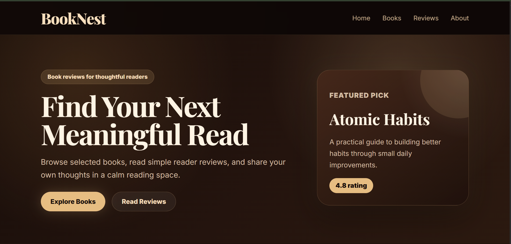
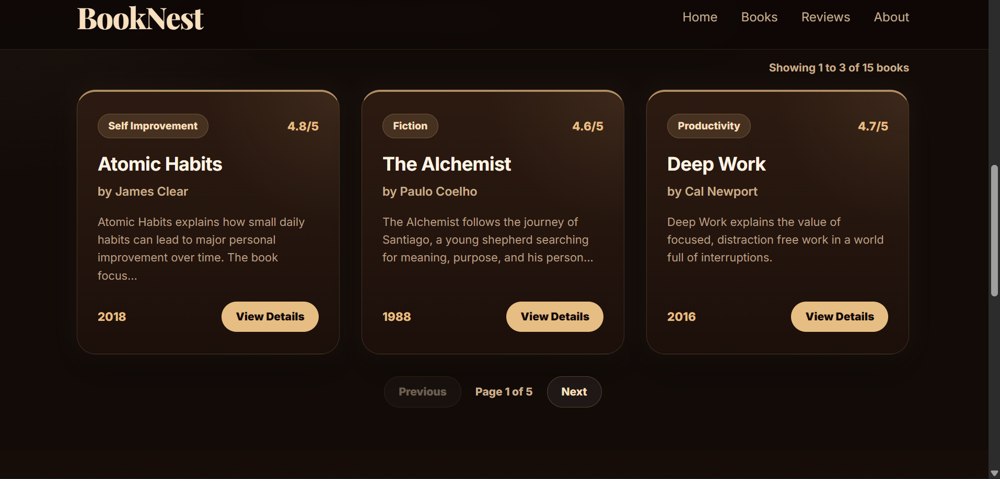
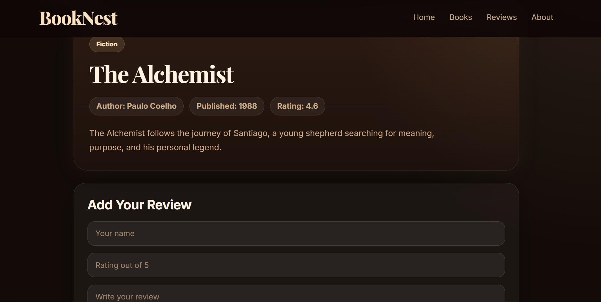

# BookNest

🔗 **Live Demo:** [booknest-fullstack-one.vercel.app](https://booknest-fullstack.vercel.app/)

## Preview

### Homepage



### Book Collection



### Book Details



BookNest is a full stack book review website built with React, Node.js, Express, MongoDB, and Mongoose. The website allows users to browse books, search by title, author, or category, open individual book details, and submit reader reviews that are stored permanently in MongoDB.

## Features

### Frontend

* Modern responsive React website
* Dark premium UI with warm glow styling
* Smooth navigation between homepage sections
* Book search by title, author, or category
* Book details page
* Review form with validation
* Loading and error states

### Backend

* Node.js and Express API
* MongoDB Atlas database
* Mongoose data models
* REST API routes for books and reviews
* Backend validation for review submission
* Permanent review storage in MongoDB

## Tech Stack

### Frontend

* React
* Vite
* React Router
* CSS

### Backend

* Node.js
* Express.js
* MongoDB Atlas
* Mongoose
* dotenv
* CORS

## Project Structure

```txt
booknest-fullstack/
│
├── client/
│   ├── src/
│   │   ├── components/
│   │   ├── pages/
│   │   ├── App.jsx
│   │   └── App.css
│   └── package.json
│
├── server/
│   ├── config/
│   ├── controllers/
│   ├── data/
│   ├── models/
│   ├── routes/
│   ├── server.js
│   └── package.json
│
├── .gitignore
└── README.md
